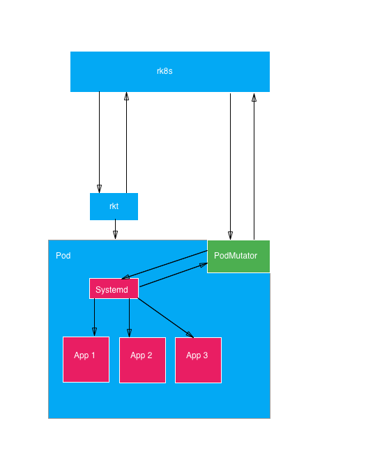

# PodMutator Service
To provide pod mutation capabilities for finer-grained control over rkt containerization concepts and debugging needs, 
this proposal introduces a new optional stage1 app/service with special semantics that is lightweight.

When added to a pod manifest, the PodMutator service, which is just an app with special semantics, 
will expose app-level operations to the outside by communicating with the systemd inside the pod.

## Architecture

PodMutator, in essence, is rkt application container manipulation logic on top systemd/systemd-nspawn calls.
Meaning that starting an App is translated into pod systemd calls to start that app's services.



- **Note:** Normal apps inside a pod will not have access to PodMutator.
- **Note:** By using a PodMutator, we'll be able to maintain an empty Pod (but not empty since it has the PodMutator app).

## Network

PodMutator will expose this interface through a special network namespace that will 
only be used by special services such as itself (use default-restricted namespace?).
And will be exposed using an RPC protocol

## Interface

```go
type AppID string

type AppState string

const (
	FailureAppState AppState = "Fail"
	SuccessAppState AppState = "Success"
	IdleAppState    AppState = "Idle"
)

type AppStatus struct {
	ID          AppID
	Name        string
	State       AppState
	Labels      []string
	Annotations []string
	Metadata    struct {
		CreatedAt time.Time
		StartedAt time.Time
		ExitedAt  time.Time
		ExitCode  int
	}
}

type PodMutator interface {
	// Inject injects a prepared app into a pod without starting it
	// Prepared app in this context means that an app that is translated
	// to systemd-spawn systemd.service
	// Computation required for preparation has to be done outside a pod.
	Inject(AppSpec, []byte) (AppID, error)
	// Start starts an injected/not started/stopped application container
	Start(AppID) error
	// Stop stops a running application container inside a pod
	Stop(AppID) error
	// Remove removes an app from a pod if it's in a non-running state
	Remove(AppID) error
	// List returns the list of apps running inside a pod
	List() ([]AppStatus, error)
	// Status returns the status of an app
	Status(AppID) (AppStatus, error)
	// Exec executes a command inside an app. (Does it have to be interactive?)
	Exec(AppID, string, []string) error
}
```

## Use Cases

- Allowing app-level imperative operations.
- Enabling empty Pods (Pods without normal apps) to be running.
- Low-level control to Pods for debugging.
